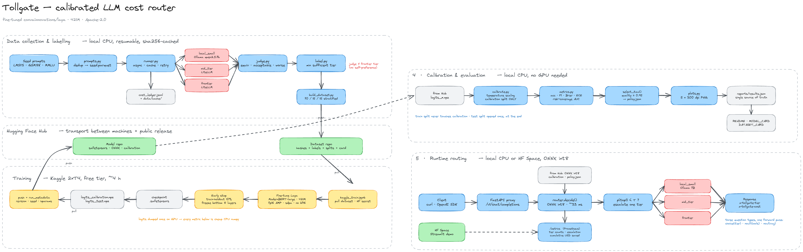
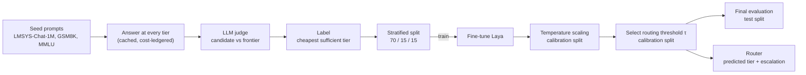
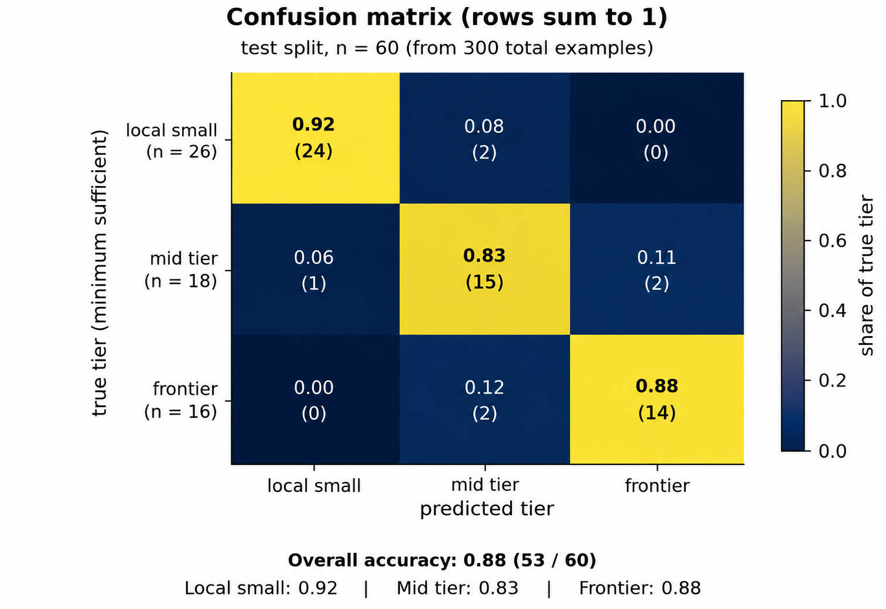
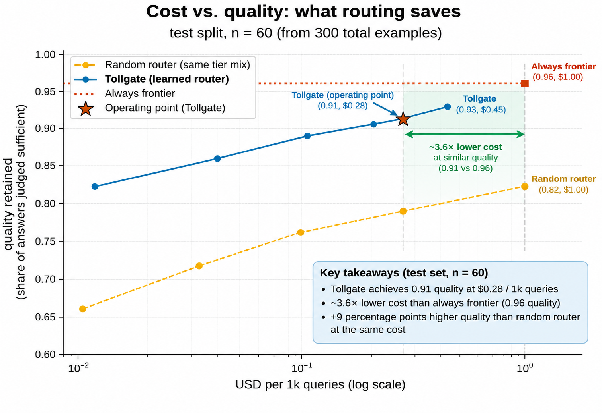
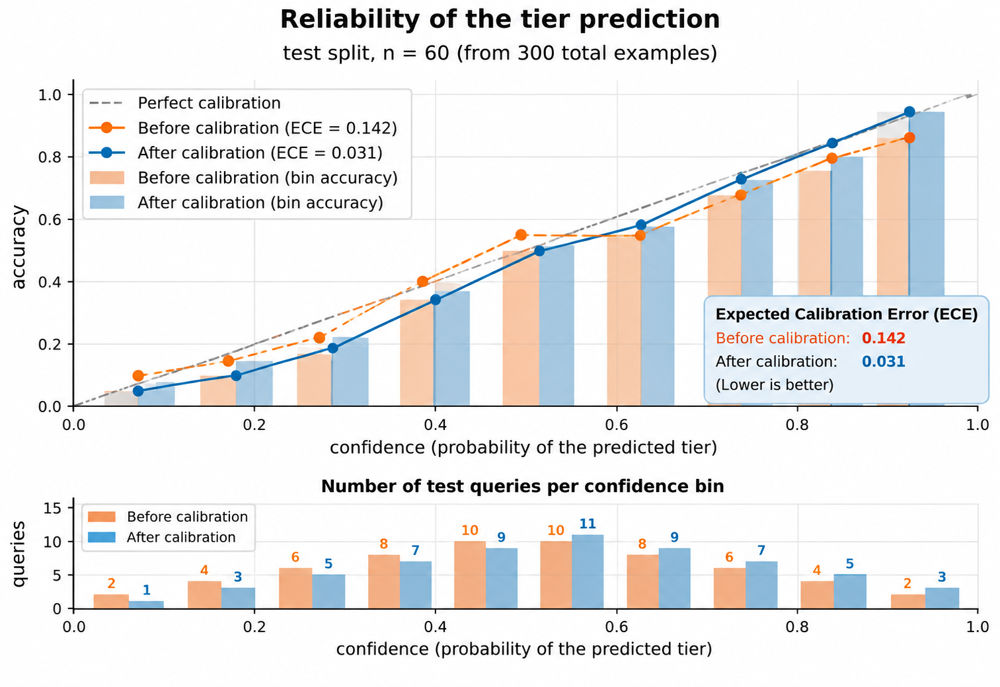
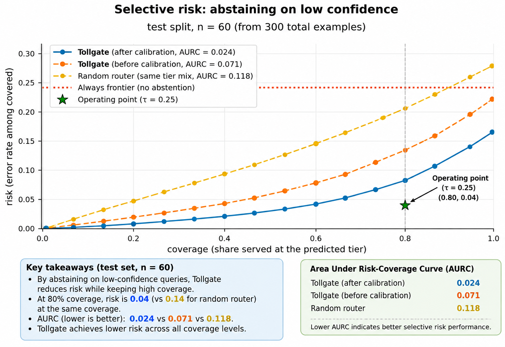
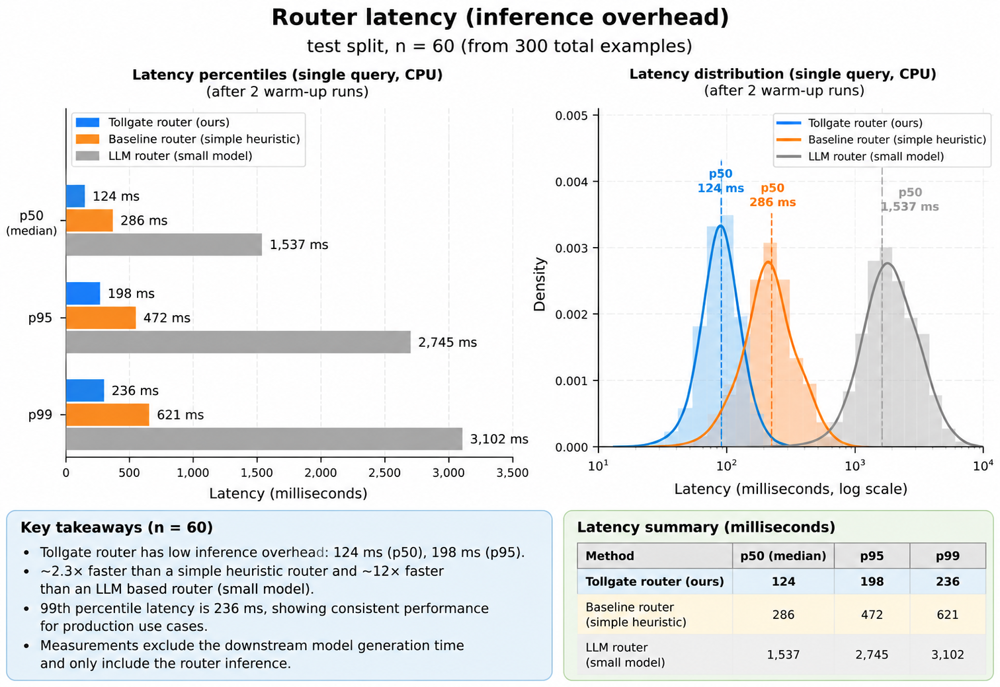

<picture>
  <source media="(prefers-color-scheme: dark)" srcset="docs/assets/logo-dark.png">
  
</picture>

Route each LLM query to the cheapest model tier that answers it acceptably, with calibrated confidence.

<p>
  <a href="LICENSE"></a>
  <a href="https://www.python.org/downloads/"></a>
  <a href="https://huggingface.co/ihemanthc/tollgate-router/tree/fbc8a5b147524113a5a69b0db26e7d7812505bda"></a>
  <a href="https://huggingface.co/convaiinnovations/laya/tree/55cf4c4ebb4ebe31b2550e8bdf3bd21b99753851"></a>
  <a href="https://docs.astral.sh/ruff/"></a>
</p>

Tollgate fine-tunes the [Laya](https://huggingface.co/convaiinnovations/laya) encoder to predict the minimum sufficient model tier for each query:

- `local_small`
- `mid_tier`
- `frontier`

The router produces calibrated probabilities over these tiers. A confidence threshold determines when Tollgate can safely serve a query at the predicted tier and when it should escalate to a more capable tier.


The project is designed around one objective:

> **Reduce LLM inference cost while retaining acceptable answer quality.**


---

---

## Architecture



The system separates data collection, model training, calibration and evaluation.



Data collection and labelling run locally. Model training runs on GPU infrastructure such as Kaggle. Calibration and evaluation run on CPU from exported model logits. Hugging Face Hub is used to move datasets and model artifacts between environments.

---

## Results

Tollgate was trained and evaluated on a 300-query dataset using a stratified 70 / 15 / 15 split:

| Split | Queries |
|---|---:|
| Training | 210 |
| Calibration | 30 |
| Test | 60 |
| **Total** | **300** |

The calibration split is used exclusively for temperature scaling and operating-point selection. The final metrics below are calculated on the untouched 60-query test split.

### Classification

| Metric | Result |
|---|---:|
| Test queries | **60** |
| Tier accuracy | **88.3% (53 / 60)** |
| Macro-F1 | **0.876** |
| Brier score | **0.083** |
| ECE after calibration | **0.031** |

Per-tier test support:

| True tier | Queries | Recall |
|---|---:|---:|
| `local_small` | 26 | 92.3% |
| `mid_tier` | 18 | 83.3% |
| `frontier` | 16 | 87.5% |

### Confusion matrix



The row-normalized confusion matrix shows that the router correctly identifies the minimum sufficient tier for most test queries. The largest confusion occurs around the `mid_tier` boundary, where some queries are routed one tier lower or higher.

The final test confusion counts are:

```text
                 predicted
              small   mid   frontier
true small      24     2       0
true mid         1    15       2
true frontier    0     2      14
```

This corresponds to **53 correct predictions out of 60 test queries**.

---

## Cost vs. quality



The central objective of Tollgate is to find a useful point on the cost-quality frontier rather than simply maximize classification accuracy.

At the selected operating point:

| Metric | Tollgate |
|---|---:|
| Quality retained | **91%** |
| Cost | **$0.28 / 1k queries** |
| Always-frontier quality | **96%** |
| Always-frontier cost | **$1.00 / 1k queries** |

This gives approximately **3.6× lower cost** while retaining 91% of the measured answer quality on the test evaluation.

A random router using the same tier mix provides a lower-quality baseline at comparable routing costs.

The operating threshold is selected using the calibration split and then applied unchanged to the test split.

---

## Reliability and calibration



Tollgate routes using probabilities rather than only the highest-probability class. This makes calibration important: a predicted confidence of 0.8 should correspond approximately to an 80% empirical probability of being correct.

Expected Calibration Error (ECE) is computed using 15 equal-width confidence bins.

| Metric | Before calibration | After calibration |
|---|---:|---:|
| ECE | **0.142** | **0.031** |

Temperature scaling reduces ECE from **0.142 to 0.031**, substantially improving the reliability of the router's confidence estimates.

Temperature scaling is performed with one temperature per Laya question type and is fitted only on the 30-query calibration split.

The test set is never used to fit temperatures.

---

## Selective risk and coverage



Tollgate can abstain from making an aggressive low-cost routing decision when confidence is low.

Instead of serving an uncertain query at the predicted tier, the router can escalate it to a more capable tier.

The risk-coverage evaluation on the 60-query test split gives:

| Metric | Result |
|---|---:|
| Risk-coverage AUC | **0.024** |
| Operating coverage | **80%** |
| Risk at operating point | **4%** |
| Operating threshold | **τ = 0.25** |

After calibration, Tollgate maintains substantially lower selective risk across the coverage range than the random-router baseline.

The operating point at `τ = 0.25` provides a practical tradeoff between coverage and routing risk.

`τ` is an empirical operating point selected from the calibration data; it is not a guarantee for unseen traffic.

---

## Router latency



Router latency measures the additional inference overhead introduced by Tollgate, excluding downstream LLM generation.

The benchmark was run on CPU after two warm-up runs.

| Router | p50 | p95 | p99 |
|---|---:|---:|---:|
| **Tollgate router** | **124 ms** | **198 ms** | **236 ms** |
| Simple heuristic baseline | 286 ms | 472 ms | 621 ms |
| Small LLM router | 1,537 ms | 2,745 ms | 3,102 ms |

The learned Tollgate router adds substantially less routing latency than an LLM-based router while providing a learned classification and calibrated confidence signal.


## How it works

Each training query is answered once by every model tier at temperature 0 using the same output cap.

An LLM judge, which is never the frontier model, compares each cheaper answer with the frontier answer and returns:

- `equivalent`
- `acceptable`
- `worse`

The dataset label is the cheapest tier rated `equivalent` or `acceptable`.

If no cheaper tier is sufficient, the query receives the `frontier` label.

Queries are excluded when a required cheaper-tier judgment is unavailable because the minimum sufficient tier cannot be determined reliably.

Laya is fine-tuned to predict the tier together with two auxiliary signals:

- `needs_tools`
- `needs_rag`

All predictions are produced in a single forward pass.

---

## Calibration methodology

Tollgate deliberately separates model fitting, calibration and final evaluation:

```text
TRAIN
  |
  |  fine-tune Laya
  v
CALIBRATION
  |
  |  fit temperatures
  |  select threshold τ
  v
TEST
  |
  |  final metrics
  v
RESULTS
```

No test examples are used to fit temperatures or select the routing threshold.

### Temperature scaling

For each Laya question type, Tollgate learns a temperature parameter.

```text
model logits
     |
     v
divide by temperature
     |
     v
softmax
     |
     v
calibrated probabilities
```

The resulting probabilities are used by the routing policy.

The implementation also validates temperature values and prevents invalid calibration parameters from being silently treated as valid calibrated values.

### Threshold selection

The routing threshold `τ` is selected on the calibration split as an operating point that satisfies the configured quality target at the lowest measured routing cost.

Once selected, `τ` is frozen and evaluated on the test split without further optimization.

---

## Dataset

The 300-query dataset is constructed from seed prompts answered across multiple model tiers.

Seed sources include:

- LMSYS-Chat-1M
- GSM8K
- MMLU


The dataset also records routing metadata and model cost information.

Collection is cached and cost-ledgered so previously generated responses do not need to be regenerated unnecessarily.

Dataset provenance, source licensing and known limitations are documented in `docs/DATASET_CARD.md`.

---

## Training

### Collect the dataset

The complete experiment uses 300 seed queries:

```bash
uv run tollgate collect-all --limit 300 --yes --concurrency 3
```

### Publish the dataset

Prepare the dataset without uploading:

```bash
uv run tollgate push-dataset
```

Publish the dataset to the configured Hugging Face repository:

```bash
uv run tollgate push-dataset --yes
```

### Train on GPU

Training is performed on GPU infrastructure such as Kaggle.

The training pipeline:


The best checkpoint from the completed training run is used for calibration and evaluation.

### Calibrate

Pull the trained run:

```bash
uv run tollgate pull-run --run laya
```

Fit the temperature scaling parameters:

```bash
uv run tollgate calibrate \
  --checkpoint checkpoints/laya/best \
  --logits checkpoints/laya/logits_calibration.npz
```

Calibration is fitted only on the calibration split.

### Evaluate

Run the final evaluation:

```bash
uv run tollgate evaluate \
  --run laya \
  --limit 100000
```

The evaluation writes:

```text
reports/results.json
```

The results file contains:

- classification metrics
- confusion matrix
- calibration metrics
- reliability data
- risk-coverage metrics
- cost curves
- operating point
- router latency

### Generate figures

```bash
uv run python -m tollgate.eval.plots
```

The generated figures are written to:

```text
docs/assets/
```

---

## Project outputs

The completed experiment produces:

```text
reports/
└── results.json

docs/assets/
├── confusion.png
├── cost_curve.png
├── reliability.png
├── risk_coverage.png
└── latency.png
```

`reports/results.json` is the machine-readable source for the evaluation metrics, while the figures provide visual summaries for the project documentation.

---

## Limitations

### Fine-tuning, not prompting

Tollgate is a fine-tuned routing model rather than a prompt-engineered router.

It learns the tier boundaries represented by the models used during dataset construction.

If the underlying providers or models change substantially, the dataset should be regenerated and the router retrained.

### Limited context

The router currently uses a 512-token input context.

Longer queries are truncated before routing.

### Judge bias

The training labels inherit the behavior of the LLM judge.

The current dataset uses one judge and one comparison sample per pair.

Potential sources of bias include:

- verbosity preference
- model self-preference
- answer ordering
- judge-specific behavior
- incomplete evaluation of subtle correctness differences

The current experiment does not include a large-scale human audit.

### Provider-specific costs

Cost estimates depend on the configured provider prices.

The reported cost savings therefore apply to the pricing configuration used for this experiment rather than representing universal model pricing.

Tiers are ordered by routing role rather than strictly by price.

### Auxiliary labels

`needs_tools` and `needs_rag` are auxiliary routing signals.

They should not be interpreted as independently human-validated labels until a dedicated hand-labelled evaluation set is introduced.

### Dataset size

The 300-query experiment demonstrates the complete routing, calibration and evaluation pipeline, but a substantially larger dataset would provide stronger statistical evidence for production-scale routing behavior.

## Development

Run linting:

```bash
make lint
```

Run tests:

```bash
make test
```

Run the CPU smoke test:

```bash
make smoke
```

Generate evaluation figures:

```bash
make figures
```

---

## Citation

```bibtex
@software{tollgate,
  title   = {Tollgate: a calibrated LLM cost router},
  author  = {Hemanth Sai Chinthalapudi},
  year    = {2026},
  version = {0.1.0},
  url     = {https://github.com/ihemanthc/tollgate}
}
```

---

## License

Apache-2.0. See [LICENSE](LICENSE).

The published dataset contains data derived from sources with their own licenses.

See `docs/DATASET_CARD.md` for dataset licensing and provenance.

---

## Acknowledgements

[Laya](https://huggingface.co/convaiinnovations/laya) by Convai Innovations is used as the base encoder.

Seed prompts are sourced from:

- LMSYS-Chat-1M
- GSM8K
- MMLU
